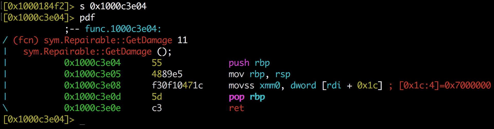
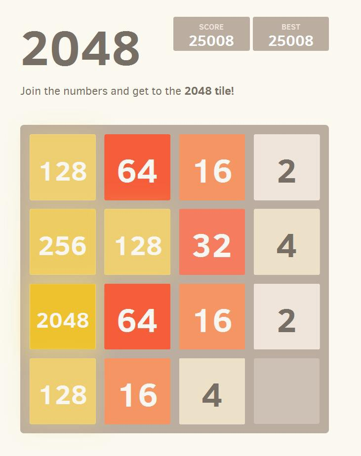
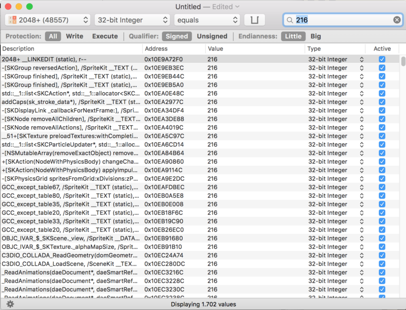
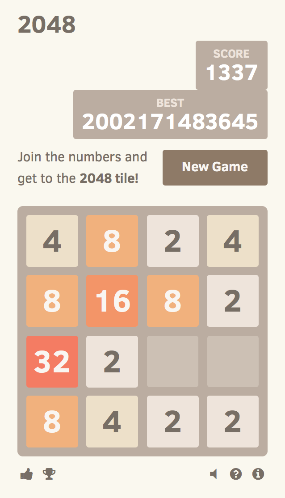
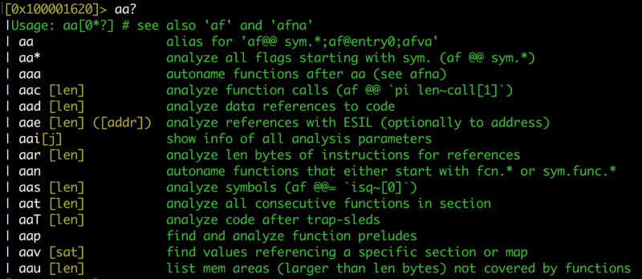
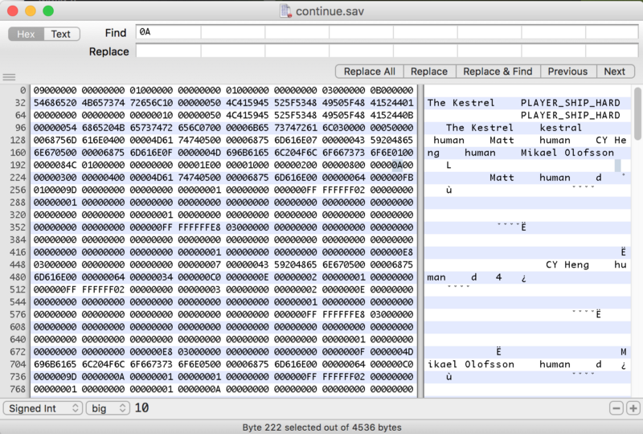
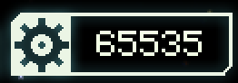
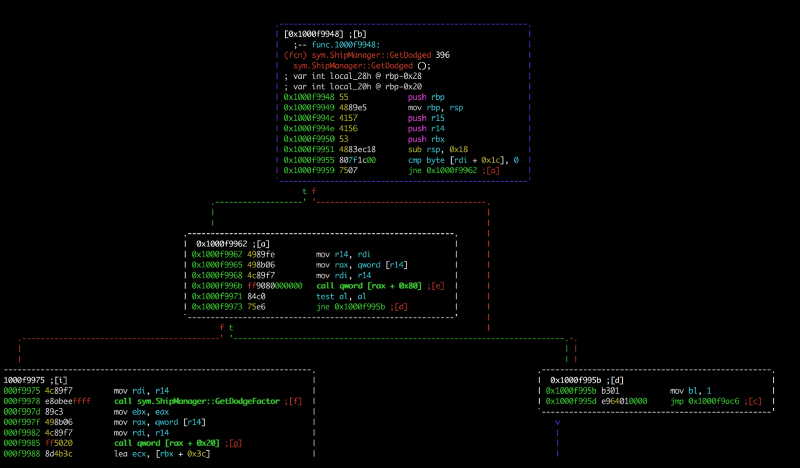
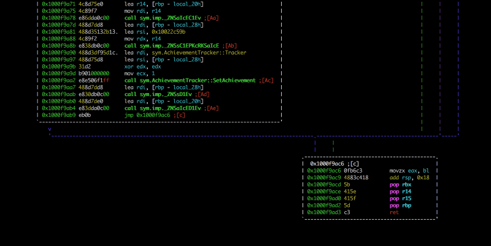
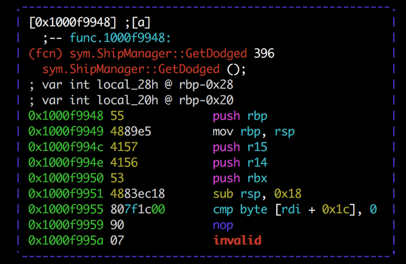

# A n3wb13 trying to cheat on games
1479254400

_That n3wb13 is me, and_ _that post is a transcription of the talk I gave at RoadSec SP_

All started with my girlfriend waving her phone at me and shouting “LOOK HOW I AM SOOOO GOOOD AT THIS”. “THIS” == 2048 , a puzzle game that became really famous a year and a half back.

And so I grabbed my macbook and started to play, being sure that I was going to OWN her. And so I’ve failed miserably :’( Now I just want to fuck the game and get the highest score possible.

### Memory editing

The first thing that came to my mind was that the score was in some place of the memory of the game, and probably I could overwrite it. Doing some research (googling arround) I stumbled upon a really wonderfull piece of open source software: [Bit Slicer](https://github.com/zorgiepoo/Bit-Slicer). It sells it self as “Universal game trainer for macOS”, exactly what I need.

All you have to do is search for the value with the desired type, Int32 in my case. My score was 216 at the time :

It found 1702 memory addresses that contain 216 as the value. That’s a lot, you need to narrow down your search, and to do so you have to change the value of the score playing a little bit , and searching within those first 1702 addresses which ones changed to your new score. In my case, my new score was 240 .

Now it just shows 2 addresses, nice.Maybe you’re asking why two and not just one, that’s probably because of some redundance as one for save the number as a Integer , and another to save the value of the String, something like that. Now I just have to edit those two to 1337.

The game it did not changed the value, but if you do something in it , it will update the value.

_Yeah , my BEST is really huge_

NICE ! I showed my girlfriend and she was like “You just edited the memory right? _rolls eyes_” . But that was too easy :/

### Editing the save

After that I realized that the game saves the last state when you close it, that made me try to find where it saves the state and edit it. Another round of Google showed me that the support files for all programs was in the `~/Library/Application Support/` directory. Unfortunately, the game wasn't there, nor the bundleId of it, `com.codinn.2048` that id is found at the `Info.plist` of the app. More of Google showed me that some Apps uses "containers" that is some sort of sandbox for the OS X apps, that resides at `~/Library/Containers/`.   
 There I found a dir with the bundleId of the game, and the plist that contains the game state : `~/Library/Containers/com.codinn.2048/Data/Library/Preferences/com.codinn.2048.plist`. Opening in Xcode :

The value of “gameState” is :

				{"grid":{"size":4,"cells":[[{"position":{"x":0,"y":0},"value":4},{"position":{"x":0,"y":1},"value":8},{"position":{"x":0,"y":2},"value":32},{"position":{"x":0,"y":3},"value":8}],[{"position":{"x":1,"y":0},"value":8},{"position":{"x":1,"y":1},"value":16},{"position":{"x":1,"y":2},"value":2},{"position":{"x":1,"y":3},"value":4}],[{"position":{"x":2,"y":0},"value":2},{"position":{"x":2,"y":1},"value":8},null,{"position":{"x":2,"y":3},"value":2}],[{"position":{"x":3,"y":0},"value":4},{"position":{"x":3,"y":1},"value":2},null,{"position":{"x":3,"y":3},"value":2}]]},"score":1337,"over":false,"won":false,"keepPlaying":false}

It’s nothing more than a json with the values and the positions of the tiles. So I just edit this and Voila, right? No :/ For some reason , probably because the app is sandboxed , even if I edit this , the gameState is not going to change . I’m sure that must be a way to bypass and edit this, I will try in the future.

### Reversing and editing the game

So , what now ? Errrrrr , I could edit the binary of the game to make more points and so on. Let’s do that !

First let’s open this on radare2 — No , I’m not trying to show off not using a GUI tool , r2 is free and opensource, and I’m just a student who doesn’t have money to buy IDA Pro or Hopper.

				$ sudo r2 -w /Applications/2048+.app/Contents/MacOS/2048+ Password: arw 000000000000000000000000000000000000000000000000000000000000000000000000000000000000000000000000000000000000000000000000000000000000000000000000000000000000000000000000000000000000000000000000000000000000000000000000000000000000000000000000000000000000000020160000010000000000000000000000000000000000000000000000000000000000000000000000 -- You see it, you fix it! [0x100001620]>

The `-w` is for writing. First thing you want to do is `aaa` to analyse all the functions and name then. The r2 has a really cool way to name the commands, it's just the first letters of the description, the first `a` is for "analyse", the second is for "all" , and the third is for "autoname" . r2 also has a really helpfull help (pun not intended) interface, just put a question mark after the command and it will show all the adjacents, something like that :

So , after run `aaa` , you want to list all the functions . Just run `afl` and it will show a ton of functions, if you put a `~` after the command it will grep it. I wanted to search for the beginning of the binary, and so I did `afl~main`; `afl~entrypoint` ; `afl~begin` ; `afl~start` , and nothing ( Note that this is case sensitive ).

I came back to basics, and did a `strings` at the binary , something really made me "WTF?" : it showed a lot of `webView` strings. So , yeah , that shit is just a web application --'

After that shitty realization , I just open the “Resources” dir in the app , and it was all the html/js/css of the app, really frustating .

				$ ls
					CONTRIBUTING.md README.md index.html sound LICENSE.txt fontello js style

That’s really easy to edit.   
 In the line 188 of the file `Resources/2048/js/game_manager.js` it's where the game calculate the new value when two tiles merges, it just multiply the previous value for 2.

				var merged = new Tile(positions.next, tile.value * 2);

So , just change the 2 to , let’s say , 9999 . And that’s beautifull .

All easy , all great. But was really fun. And now I’m the first of the global rank ^^

### Faster Than Light

FTL is a indie game , rouge-like , with spaceships and battles ‘n shit . Lots of fun , but really hard ( I’ve never beaten the last boss ) . So , let’s hack the shit out of it .

#### Memory, bleh

I’ve started with the same memory editing we did at 2048+ . You really can edit all the variables, your life , the enemy’s life , the money , etc . The same procedure , the same results , bleh .

_Note those numbers not fitting the boxes_

#### Editing the save

But the game is more complex, so you have to constantly edit your life , you can’t edit your damage (because you don’t know what to search), and that’s boring.

First thing I tried was to edit the save game, because I failed in the last game. The save game is at `~/Library/Application Support/fasterthanlight` , not in the `Containers`, so no sandbox, nice . The files :

				$ lsae_prof.sav continue.sav prof.sav settings.ini

`settings.ini` is just a txt with the configurations of the game, sound , fullscreen, etc. The .sav ones is the saves/stats/achievements. So , wtf is that ?

				$ file continue.sav
				continue.sav:data
				$ xxd continue.sav
				0000000: 0900 0000 0000 0000 0100 0000 0100 0000 ................ 0000010: 0400 0000 1600 0000 0300 0000 0b00 0000 ................ 0000020: 5468 6520 4b65 7374 7265 6c10 0000 0050 The Kestrel....P 0000030: 4c41 5945 525f 5348 4950 5f48 4152 4401 LAYER_SHIP_HARD. 0000040: 0000 0000 0000 0003 0000 000a 0000 0066 ...............f 0000050: 6972 6564 5f73 686f 7405 0000 0006 0000 ired_shot....... 0000060: 0068 6967 686f 3201 0000 000c 0000 0075 .higho2........u 0000070: 7365 645f 6d69 7373 696c 6502 0000 0010 sed_missile..... 0000080: 0000 0050 4c41 5945 525f 5348 4950 5f48 ...PLAYER_SHIP_H 0000090: 4152 440b 0000 0054 6865 204b 6573 7472 ARD....The Kestr 00000a0: 656c 0700 0000 6b65 7374 7261 6c03 0000 el....kestral... 00000b0: 0005 0000 0068 756d 616e 0700 0000 4359 .....human....CY 00000c0: 2048 656e 6705 0000 0068 756d 616e 0600 Heng....human.. 00000d0: 0000 4772 6163 6965 0500 0000 6875 6d61 ..Gracie....huma 00000e0: 6e06 0000 0041 7472 6579 7501 0000 00c2 n....Atreyu..... ... ETC

That is a proprietary file format , so I have to try to understand where is the values I want to edit. I’ve used the HexFiend app , which is a hex editor for Mac , also open source , in fact Bit Slicer uses some part of their code.

First I want to edit how much scrap I have ( which is the money of the game ) . If I was doing that with the BitSlicer , I would have to be able to change the value to narrow down the research.   
 My money at the time was 10 , which in hexa is `0xa`, so just search:

`0xa` is a shit value because it appears a lot , not as much as in the memory , but a lot . In the beginning of the file it has some information that matches with my ship, like the name , the crew , so I presume that the first `0A` is the money ( yeah , I'm a guessing knight ) . Just edit the first appearance to `FFFF` ( 65535 ) , save it , and BANG!

Oh! Another guess was the file `continue.sav` , the other ones have other states of the game , score , achievements . I could do a reverse in the binary to find more values , and be more precise , but that would take days .

#### Reversing the binary

The other thing I wanted to do was to be invencible without the need to edit the memory by hand all the time . r2 time !

The binary of the game is at `/Library/Application Support/Steam/steamapps/common/FTL Faster Than Light/FTL.app/Contents/MacOS/FTL` because it it's on the Steam. First I've checked if it was a WebApp , and it wasn't :'(

Running on the r2 and analysing all the functions take some time, and after that I started to look with functions that had something with “Damage”

				[0x1000f9959]> afl~Damage 0x100018382 1 8 sym.Collideable::DamageBeam 0x10001838a 1 8 sym.Collideable::DamageArea 0x100018392 1 8 sym.Collideable::DamageShield 0x1000183bc 1 6 sym.Targetable::DamageTarget 0x1000184f2 1 60 sym.Projectile::SetDamage 0x10001a9b8 3 168 sym.IonDrone::GetRoomDamage 0x10001b778 3 35 sym.CrewDrone::ShipDamage 0x10001cb80 1 14 sym.CrewMember::GetDamageMultiplier 0x10001cbe2 1 83 sym.CrewMember::GetRoomDamage 0x10001ce52 1 14 sym.BoarderDrone::GetDamageMultiplier ... ETC ... ETC

After some hours analysing the functions, all of them or really did nothing special, or I was unable to edit because of some really weird instructions, like :

Really , I have no idea what those instructions do,and I’ve searched, it’s something with double/float types I think .   
 So I had a idea, the ship is able to dodge missiles and shoots, it has to be a function that calculates that.

				[0x1000f8104]> afl~Dodge 0x10001839a 1 8 sym.Collideable::GetDodged 0x1000f8828 19 340 sym.ShipManager::GetDodgeFactor 0x1000f9906 1 47 sym.ShipManager::GetNetDodgeFactor 0x1000f9935 1 18 sym.non_virtualthunktoShipManager::GetDodged__ 0x1000f9948 20 396 sym.ShipManager::GetDodged 0x100112c18 2 27 sym.ShipSystem::GetEngineDodgeFactor 0x1001137d0 8 159 -> 105 sym.EngineSystem::GetDodgeFactor

And looking at `sym.ShipManager::GetDodged` :

				[0x1000f8104]> s sym.ShipManager::GetDodged [0x1000f9948]> VV

`s` stands for "seek" , and `VV` is for enter the visual mode. `p` in visual mode change the type of the visualization .

_Beginning of the function_

_End of the function_

At the end ( second print ) , in `0x1000f9ac6` it just move the register `bl` to the `eax` and return it, so `bl` must be the register that holds if the ship was able to dodge or not . And in the `0x1000f995b` ( first print ) it moves 1 to `bl` and jumps to the end of the function . Now, the first jump `0x1000f9959` is a `jne` ( Jump Not Equal ) , which check if the last cmp `0x1000f995` was successful , if it was jumps to `0x1000f9962` , if not just continues the execution . Well , the chain of execution which leads to `0x1000f9962` it's really confusing and it does a lot of compares and checks to determine if it will mov 1 or 0 to `bl` , so I just want to the function return 1 , and always dodge . Editing the `0x1000f9959` and puting a `nop` ( instruction that does nothing ) instead of the `jne` , it will result to the function always mov 1 to `bl` and `jmp` to the finish . Let's do that :

				[0x1000f9948]> s 0x1000f9959 [0x1000f9959]> wa nop Written 1 bytes (nop) = wx 90

Resulting in :

Now , if you look at `0x1000f995a` , it shows "invalid" , because the `90` which is the `nop` hexadecimal representation did not overwrite all the `jne` hexa `7507` . Let's just put a `nop` at the remaining and it's all good , probably there is a better way to do , but fuck it .

				[0x1000f995b]> s 0x1000f995a [0x1000f995a]> wa nop

Now it will always dodge things , nice ! SUPER NINJA MODE (: You can edit anything you want in the game, but that was the simplest way I’ve found to become invincible .

### Scripting

Another way of beating the game is dealing TONS OF DAMAGE, but edit the assembly is hard, and editing the memory is not. But how to make things easier ? Well , the BitSlicer has a bultin Python Library to Scripting , yaaaaay !

First thing is to find the memory address of the enemy’s life. Do the same search and when you find the address right click in it and “Watch Write Accesses” , now every time some instruction writes in that address we will see. Unpause the game and attack your enemy, and pause again to see that two instructions writed in that enemy’s life address,add those two to the list. One instruction have hundreds of writes and another just the times you attacked, open the one with less writes on the debugger and see that the Symbol points to `Ship::ProjectileStrike(int,float)`, that's the function that does damage.

Now analysing the assembly : `mov [rdi+0x70], eax` . `[rdi+0x70]` is the register that holds the enemy's life and the one we want to edit it is stored at `0xD642`, that value doens't change , so I've made that script :

from bitslicer import VirtualMemoryError, DebuggerError  
import keycode, keymod

				class Script(object):  
						def __init__(self):
								self.currentLifeAddress = None # variable to store where the enemy's life address is
								debug.registerHotkey(keycode.A, keymod.CONTROL, self.killShip) # Add a hotkey to call the self.killShip function
								debug.addBreakpoint(vm.base() + 0xDC642, self.shipDamaged) # Make a breakpoint every time that mov [rdi+0x70], eax is reached and call self.shipDamaged , vm.base() is the pagination of the memory , this changes every time it loads

						def killShip(self,hotkeyID) :
								if self.currentLifeAddress is not None: 
										vm.writeInt32(self.currentLifeAddress,0) # write 0 at the enemy's life

						def shipDamaged(self, instructionAddress, registers):
								self.currentLifeAddress = registers['rdi']+0x70 # gets the address of enemy's life
								debug.log(registers['rdi']) # debug shit
								debug.resume()

						def finish(self):
								debug.log('Cleaning up..')
								pass

It’s all commented, add that to the BitSlicer, make some damage in the enemy to get the address of his life and `cntrl+a` to kill it ˆ-ˆ

That sums up all the ways to cheat in a offline game, I’m doing some research at online games and reversing their protocol, but that will take time.

ty !
