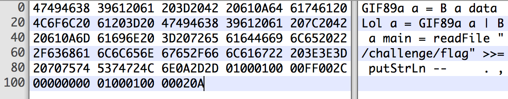

# Six files that are also a valid PHP
1496966400

And a GIF that is also a Python

That history begins with me trying to make a GIF that is also a valid Haskell, all that for a [CTF challenge](https://github.com/p4-team/ctf/tree/master/2016-12-27-33c3/web_150_try). Although was a pain in the ass to kill this challenge, the idea of having one file that has two format was really interesting and somewhat useful to bypass upload restrictions and execute the unexpected type of your file with some LFI.

The GIF/Haskell file ,made by Manoel (@reefbr)

### GIF + PHP

I was reading the [PoC||GTFO](https://www.alchemistowl.org/pocorgtfo/) Journal and they love the idea of a _polyglot file_, one of their issues is a [PDF/Zip and NES ROM ](https://www.alchemistowl.org/pocorgtfo/pocorgtfo14.pdf), so I started with the simplest — and probably the only one that is useful — file format : PHP. Why is the simplest? Because you can state where the code starts with <? and where it ends with ?> , with that I can put the PHP code anywhere in the file.

I already knew something about GIF, so let’s start with it. Having in mind that the content of the GIF is worthless to us the [tiniest GIF possible](http://probablyprogramming.com/2009/03/15/the-tiniest-gif-ever) is a great place to start :

HEX   : 47 49 46 38 39 61 01 00 01 00 00 FF 00 2C 00 00 00 00 01 00 01 00 00 02 00 3B

ASCII : GIF89a���ÿ�,��������;

As explained in the blog post, that makes a 1x1 black gif and it should break because it doesn’t have the [Global Color Table](http://www.matthewflickinger.com/lab/whatsinagif/bits_and_bytes.asp), but it works because the readers does not follow the specification at risk. Now I want to put my PHP string somewhere in there. Reading the [GIF89a Specification](https://www.w3.org/Graphics/GIF/spec-gif89a.txt) I’ve found the Comment Extension which allow us to put a comment in the GIF at the end of the file. Something like that :

							7 6 5 4 3 2 1 0        Field Name                    Type  
						 +---------------+  
					0  |      0x21     |       Extension Introducer          Byte  
						 +---------------+  
					1  |      0xFE     |       Comment Label                 Byte  
						 +---------------+  
					
						 +===============+  
						 |    <?         |  
					N  |    phpinfo(); |       Comment Data            Data Sub-blocks  
						 |               |  
						 +===============+  
					
						 +---------------+  
					0  |       ;       |       Block Terminator              Byte  
						 +---------------+

So now we can append our PHP code as a comment in the GIF :

HEX   : 47 49 46 38 39 61 01 00 01 00 00 FF 00 2C 00 00 00 00 01 00 01 00 00 02 00 21 FE 3C 3F 70 68 70 69 6E 66 6F 28 29 3B  
ASCII : GIF89a���ÿ�,��������!þ<?phpinfo();

Note that !þ = 0x21 0xFE , and PHP doesn’t require the ?> at the end. Also GIF makes easy for us having the [EOF](https://en.wikipedia.org/wiki/End-of-file) as a semicolon.

### PHP + PDF

Following the steps of PoC||GTFO let’s play with PDF. The plan still the same, get the simplest PDF possible and try to append a comment.

I had a problem with the first part of the plan, I use OS X and his PDF reader is restrict as fuck, almost every simple PDF that I’ve found in the internet has some error for the OS X’s reader. The only one that is all in ASCII and worked for me was this one: [https://stackoverflow.com/a/32142316](https://stackoverflow.com/a/32142316)

				%PDF-1.2 9 0 obj<<>>streamBT/ 9 Tf(Test)' ETendstreamendobj4 0 obj<</Type /Page/Parent 5 0 R/Contents 9 0 R>>endobj5 0 obj<</Kids [4 0 R ]/Count 1/Type /Pages/MediaBox [ 0 0 99 9 ]>>endobj3 0 obj<</Pages 5 0 R/Type /Catalog>>endobjtrailer<</Root 3 0 R>>%%EOF

It has a lot of parts that isn’t required for other readers, like the Chrome’s reader, and it should be really smaller but it doesn’t matter. PDF is much simpler, like any program language it has a code for comments which is % , so just put that after any line and append the PHP code .

				%PDF-1.2 %<?phpinfo()?>  

### Simplest approach

Surfing in the WEB I’ve found [something really beautiful](https://github.com/mathiasbynens/small) , a repository with a huge list with the “Smallest possible \[…\] file“, so I started to try append PHP to some of that files.

As it turns out, most of the files has a [EOF](https://en.wikipedia.org/wiki/End-of-file) of some kind to state that the file has ended, and most readers just ignores anything that is put after that [EOF](https://en.wikipedia.org/wiki/End-of-file). Here is four examples :

#### ELF + PHP

				HEX   : 7F 45 4C 46 01 01 01 00 00 00 00 00 00 00 00 00 02 00 03 00 01 00 00 00 19 40 CD 80 2C 00 00 00 00 00 00 00 00 00 00 00 34 00 20 00 01 00 00 00 00 00 00 00 00 40 CD 80 00 40 CD 80 4C 00 00 00 4C 00 00 00 05 00 00 00 00 10 00 00 3C 3F 70 68 70 69 6E 66 6F 28 29 3B 3F 3E  
				ASCII : ELF��������������@̀,�����������4� ���������@̀�@̀L���L���������<?phpinfo();?>

#### MP3 + PHP

				HEX   : FF E3 18 C4 00 00 00 03 48 00 00 00 00 4C 41 4D 45 33 2E 39 38 2E 32 00 00 00 00 00 00 00 00 00 00 00 00 00 00 00 00 00 00 00 00 00 00 00 00 00 00 00 00 00 00 00 00 00 00 00 00 00 00 00 00 00 00 00 00 00 00 00 00 00 3C 3F 70 68 70 69 6E 66 6F 28 29 3B 3F 3E  
				ASCII : ÿãÄ���H����LAME3.98.2�������������������������������������������������<?phpinfo();?>

#### JPG + PHP

				HEX   : FF D8 FF DB 00 43 00 03 02 02 02 02 02 03 02 02 02 03 03 03 03 04 06 04 04 04 04 04 08 06 06 05 06 09 08 0A 0A 09 08 09 09 0A 0C 0F 0C 0A 0B 0E 0B 09 09 0D 11 0D 0E 0F 10 10 11 10 0A 0C 12 13 12 10 13 0F 10 10 10 FF C9 00 0B 08 00 01 00 01 01 01 11 00 FF CC 00 06 00 10 10 05 FF DA 00 08 01 01 00 00 3F 00 D2 CF 20 FF D9 3C 3F 70 68 70 69 6E 66 6F 28 29 3B 3F 3E  
				ASCII : ÿØÿÛ�C� 

						
				    
				      
				  
				  
				 ÿÉ� ���ÿÌ��ÿÚ���?�ÒÏ ÿÙ<?phpinfo();?>

Append PHP to JPEG is really old, but everyone just put in the [EXIF](https://en.wikipedia.org/wiki/Exif), and I consider it cheating.

#### BMP + PHP

				HEX  : 42 4D 1E 00 00 00 00 00 00 00 1A 00 00 00 0C 00 00 00 01 00 01 00 01 00 18 00 00 00 FF 00 3C 3F 70 68 70 69 6E 66 6F 28 29 3B 3F 3E  
				ASCI : BM���������� ���������ÿ�<?phpinfo();?>

### Bonus round :

After that finding I started playing with something more hardcore. A GIF that is also a valid Python. None of the above “_techniques_” works because you can’t just say to Python Interpreter where to start to run the code like PHP. Let’s take another look at another GIF :

				HEX   : 47 49 46 38 39 61 01 00 01 00 80 01 00 FF FF FF 00 00 00 21 F9 04 01 0A 00 01 00 2C 00 00 00 00 01 00 01 00 00 02 02 4C 01 00 3B  
				ASCII : GIF89a��€�ÿÿÿ���!ù  
				��,�������L�;

Let’s try a error based analysis, what is the error that this file gives when run as a .py ?

				$ python tinytrans.gif  
					File "tinytrans.gif", line 1  
						GIF89a  
          ^  
SyntaxError: invalid syntax

It throws a syntax error at the 0x01 byte, which is expected. The [GIF Magic Number](https://en.wikipedia.org/wiki/Magic_number_%28programming%29#Magic_numbers_in_files) specifies that is a GIF and that his version is “89a”, it turns out that every reader just require that the version is 89 or 87 ignoring the “a” part, so we can replace the “a” with a “=” and state that “GIF89” is a variable, that should be a nice start. Let’s run again.

				$ python tinytrans.gif  
					File "tinytrans.gif", line 1  
						GIF89=  
									^  
				SyntaxError: invalid syntax

Again , as expected. The first idea that I have was to just comment the gibberish part of the GIF and put a comment, just like at the PHP+GIF, that is a valid python and it was going to be fine. But in the middle of the gibberish it has a 0x0a byte, which is also a new line, that bugs all my attempts. I was trying to make something like this :

				GIF89=\\  
				#GIBBERISH$@!\_K$!@$!(@#@!\_#)!@!@!þ\\  
				\_\_import\_\_('os').system('ls');

That is, a multi-line variable declaration using the ‘\\’ and in the middle of it just commenting the Non-ASCII, after that appending the ‘!þ’ to start a GIF comment, jumping to another line and putting the actual code, following by the EOF’s semicolon, which is also valid in Python.

But trying to make a comment in a multi-line variable declaration was just impossible, but making that inside a parentheses was valid : [https://stackoverflow.com/a/22914853](https://stackoverflow.com/a/22914853) . New try :

				HEX :

				47 49 46 38 39 3D 28 0A 00 00 80 01 00 FF FF FF 00 00 00 21 F9 04 01 00 00 01 00 2C 00 00 00 00 01 00 01 00 00 02 02 4C 01 00 21 FE 0A 5F 5F 69 6D 70 6F 72 74 5F 5F 28 27 6F 73 27 29 2E 73 79 73 74 65 6D 28 27 6C 73 27 29 29 3B

				ASCII :

				GIF89=(  
				��€�ÿÿÿ���!ù���,�������L�!þ  
				\_\_import\_\_('os').system('ls'));

Note that the interpreter will just ignore the line that starts with a Non-ASCII character, which is odd, so we don’t need the # . And Running :

				$ python python.gif  
				bash.gif  handtinyblack.gif php.elf   php.mp3   tinytrans.gif  
				bmp.bmp   php-logo-virus.jpg php.gif   php.pdf   tinytrans.gpy  
				dude.gif  php.bmp   php.jpg   python.gif  tinytrans.py

Yay !
